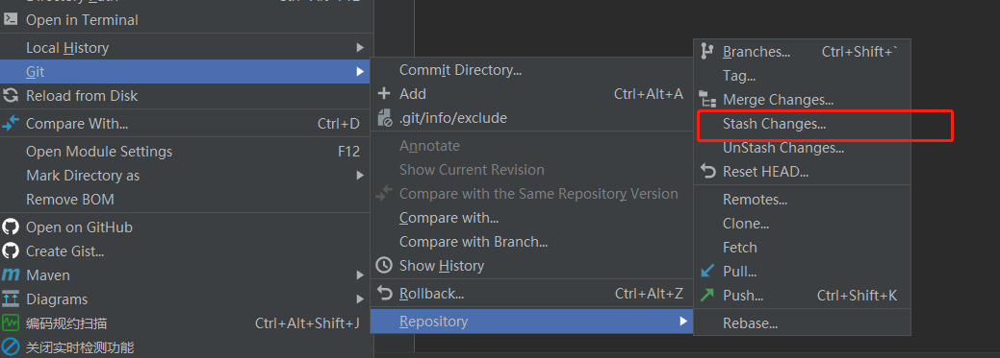

##### "unable to create file : Filename too long"  错误解决
 >执行:    git config --system core.longpaths true

####切换分支
#####不想把当前分支修改的内容合并到切换的分支
#####当前分支： A 要去B分支修改问题，但是两个分支无关。
>1、 选中当前A0分支， 右键 → git → Repository → Stash Changes..  
    
>
>
>会弹出一个界面。最好对 Message 中写一个标记性的话。  
>
>2、选择要切换的B分支，选择 Force CheckOut。 
>> Force CheckOut 是指放弃当前分支修改的内容切换到其他分支  
>>Smart CheckOut 是指将当前分支修改的内容同步到要切换的分支   

>3、 从B分支切换回A分支时，仍然选择 Force CheckOut。切换后发现变更的文件已经没了。。。
>选择项目邮件 右键 → git → Repository → UnStash Changes..  
>选择上次保存的标签。  点击 Apply stash,就可以看到上次变更的内容又回来了。

